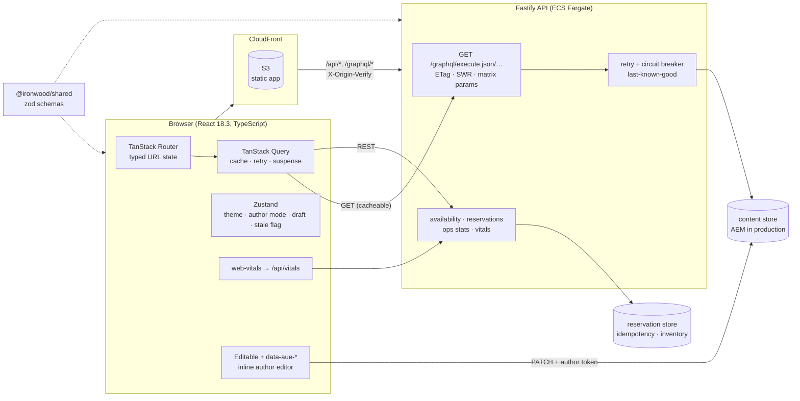
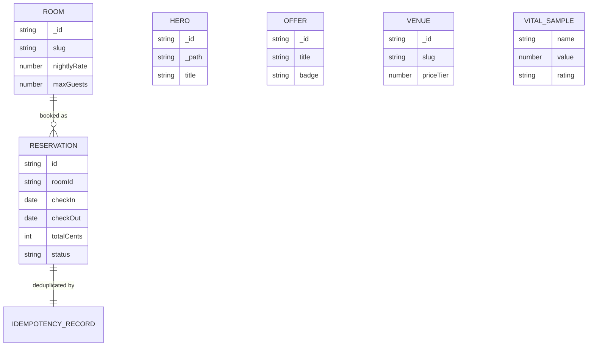

# Ironwood Resorts: Solution Deep Dive

*A fault-tolerant, headless hospitality website explained from first principles, with every screen drawn. Written for someone who has never built on a headless CMS.*

> **Reading guide.** §1 to §6 explain the problem and the design. §7 walks the failure modes. §8 is the **screen atlas**: a wireframe for every screen and state, with its purpose, its place in the journey and what the person can do. §9 onward covers structure, quality, shipping, running and limits.
> **Honesty note.** Wireframes are drawn from the code as built. Nothing here was rendered in a real browser while writing; `SRS-Compliance.md` lists what was and was not verified.

## Contents
1. [The problem in plain words](#1-the-problem-in-plain-words) · 2. [The design in one page](#2-the-design-in-one-page) · 3. [The contracts](#3-the-contracts) · 4. [Guarantees and how each is enforced](#4-guarantees-and-how-each-is-enforced) · 5. [Data model](#5-data-model) · 6. [Who can do what](#6-who-can-do-what) · 7. [What goes wrong, and what happens](#7-what-goes-wrong-and-what-happens) · 8. [Screen atlas](#8-screen-atlas) · 9. [Folder tour](#9-folder-tour) · 10. [Design system](#10-design-system) · 11. [Quality](#11-quality) · 12. [Shipping](#12-shipping) · 13. [Running it](#13-running-it) · 14. [Limits and next steps](#14-limits-and-next-steps) · 15. [FAQ and glossary](#15-faq-and-glossary)

---

## 1. The problem in plain words

A resort's marketing team wants to change a headline on Tuesday afternoon without asking engineers for a release. A guest wants to see a price they can trust and book without the page jumping around. An operator wants to know what is booked. And when the content system has a bad minute, the guest should still be able to book.

That is four different people pulling on one website. The design exists to let all four win at once:

| Word | Meaning here | Everyday picture |
|---|---|---|
| **Headless** | Content lives in a CMS (AEM) and arrives as data; the site decides how it looks | A menu printed by the kitchen, laid out by the restaurant |
| **Persisted** | Queries are stored on the server and called by name, so they can be cached and cannot be tampered with | Ordering "number 4" instead of dictating a recipe |
| **Degradable** | If content fails, the site serves its last good copy and keeps selling | A shop that keeps trading on the lights from a generator |
| **Honest** | The price on the screen equals the price at booking: integer cents, tax and fees shown | A receipt that matches the menu |

## 2. The design in one page



One package, `@ironwood/shared`, holds the content models, booking rules and vital thresholds. **Both sides import the same schemas**, so "what a room is" is defined once and a drift in AEM fails loudly at one boundary instead of as `undefined` deep inside a component.

## 3. The contracts

### 3.1 Content: persisted GET queries
```text
GET /graphql/execute.json/ironwood/rooms-list
GET /graphql/execute.json/ironwood/room-by-slug;slug=skyline-king
```
Names available: `home-hero`, `offers-list`, `rooms-list`, `venues-list`. Matrix parameters after the name become variables. Responses carry `ETag` and `Cache-Control: public, max-age=30, stale-while-revalidate=120`; a repeat request with `If-None-Match` gets `304`. In production `POST /graphql` is refused, exactly like AEM Publish.

### 3.2 Availability and pricing
`GET /api/availability?checkIn=YYYY-MM-DD&checkOut=YYYY-MM-DD&guests=N` returns, per room, whether it is available, why not, and a quote: `nights`, nightly rates with weekend uplift, `subtotalCents`, `taxesCents` (13.5 %), `feesCents` ($35 per night), `totalCents`.

### 3.3 Reservations
`POST /api/reservations` with header `Idempotency-Key`. Same key, same result; inventory checked on the server (40 / 30 / 12 / 2 units). Overbooking returns `409`.

### 3.4 Authoring
`PATCH /api/content/:model/:id` with `x-author-token`, body `{ "prop": "title", "value": "New headline" }`. The updated fragment is validated against the model, the last-known-good cache is cleared, and the next content read shows the change.

### 3.5 Health and vitals
`/healthz`, `/readyz`; `POST /api/vitals` (JSON or `text/plain` beacon); `GET /api/vitals/summary` returns p75 per metric, rated *good / needs-improvement / poor*.

## 4. Guarantees and how each is enforced

| Guarantee | Enforced by | Tested by |
|---|---|---|
| Clients cannot craft queries in production | Ad-hoc route refused unless enabled | API: *blocks ad-hoc GraphQL in production* |
| Content is cacheable and revalidatable | ETag + SWR headers, GET only | API: *ETag revalidation* |
| A content outage does not stop bookings | Retry, breaker (3 failures, 10 s), LKG with `x-content-stale` | API: *last-known-good*, *breaker*, *retries transient only* |
| A retried booking never doubles | Idempotency key stored with the result | API: *requires an Idempotency-Key and replays safely* |
| No overbooking | Inventory check before commit | API: *prevents overbooking* |
| The price is the same everywhere | One pricing function, integer cents, shared rules | API: *prices stays…*; shared stay tests |
| Edits cannot corrupt a model | Zod validation on every PATCH | API: *rejects edits that violate the content model* |
| Bad config never reaches production | Boot-time validation, default token refused | API: *refuses the default author token* |
| The hero paints fast and nothing jumps | Preload, `fetchpriority=high`, intrinsic dimensions | Web: *prioritises the LCP candidate*, *reserves intrinsic space* |
| Bundles stay small | Build fails over budget | Build script: entry 90 kB, total 260 kB gzipped |
| Pages are accessible | Radix primitives, skip link, focus management, axe | Web axe test; Playwright axe (written, not run) |

### The two follow-up questions
**"What if the content service is down and nothing is cached?"** The API returns `503` for content, the affected section shows its own error with *Try again*, and everything else (availability, booking) still works. **"What if a guest double-clicks Confirm?"** The button disables while pending, and even if two requests escape, the idempotency key makes the second a replay.

## 5. Data model



Content fragments (`hero`, `offer`, `room`, `venue`) are authored in AEM. Reservations and idempotency records belong to the booking system. Inventory is **not** authorable content: it is a physical fact. All money is integer cents.

## 6. Who can do what

| Capability | Guest | Author | Operator | Engineer |
|---|:-:|:-:|:-:|:-:|
| Browse, price, book | X | X | X | X |
| Edit content fragments | | X | | |
| Set chaos failure rate | | X | | X |
| View ops console and vitals summary | | | X | X |

The reference has **no login for the operator**; it assumes corporate SSO at the edge (`SRS §2.5`). The author token is a demo secret; in production authors use AEM's own authentication and the production web build embeds no token.

## 7. What goes wrong, and what happens

| Situation | Behaviour |
|---|---|
| Content service slow or flaky | Retries (2), then the breaker opens after 3 failures |
| Breaker open, cache warm | LKG content served, `x-content-stale: true`, `no-store`; amber banner says pricing and availability are still live |
| Breaker open, cache empty | `503` for that query; only that section shows *We couldn't load …* with *Try again* |
| API returns a 4xx | Not retried (client error) |
| API returns 5xx or network error | Query retries with exponential backoff, capped at 8 s |
| Guest submits an incomplete form | Error summary announced; focus moves to the first invalid field |
| Same booking submitted twice | Second is a replay of the first |
| Last penthouse taken by someone else | `409`; guest sees the message and can choose another suite |
| Suite cannot fit the party | Card shows a destructive badge with the reason; Reserve is not offered |
| Author enters an over-long headline | PATCH rejected; editor shows the validation message |
| AEM changes a field's shape | Zod parse fails at the boundary, in one place |
| New release is unhealthy | ECS circuit breaker rolls the deployment back |
| Someone hits the ALB directly | `403`; only CloudFront's secret header is accepted |
| User prefers reduced motion | Animations are disabled |
| JavaScript chunk for `/ops` fails | Route error page with *Try again*; the rest of the site is unaffected |

---

## 8. Screen atlas

Conventions: frames are 1440×900, fluid down to 360. `[ ]` is a button or field, `(icon)` an icon, `{x}` a value from data. Every screen sits inside the **shell** (S01).

### S01 · App shell
**Layout** sticky header 56; content `container`; footer. A skip link is the first tab stop. A live region announces route changes; focus moves to `<main>`.
```text
+--------------------------------------------------------------------------+
| [Skip to main content]   (hidden until focused)                          |
| IRONWOOD     Stay  Dining  Ops console  Engineering            (sun/moon)|
|--------------------------------------------------------------------------|
| (wifi-off) Showing saved content while our content service recovers...   |  <- only when stale
|--------------------------------------------------------------------------|
|                              <main id="main">                            |
|                                                                          |
|--------------------------------------------------------------------------|
| footer                                                                   |
| ~ Author mode bar (fixed bottom, only with ?author=1) ~~~~~~~~~~~~~~~~~~ |
+--------------------------------------------------------------------------+
```
**Purpose** One consistent frame; the place where accessibility, theme and degradation are communicated. **Role** Every page. **You can** navigate, toggle light/dark (persisted), see when content is stale. **States** default · stale banner · author mode · mobile (nav wraps to its own scrollable row). **Who** anyone.

### S02 · Home
```text
+--------------------------------------------------------------------------+
| {eyebrow}                                                                |
| {title: hero headline}                                   +--------------+|
| {subtitle}                                               |  hero image  ||
| [ {cta.label} ]                                          |  (LCP, eager)||
|                                                          +--------------+|
|--------------------------------------------------------------------------|
| Offers                                                                   |
| +--------------+  +--------------+  +--------------+                     |
| | [badge]      |  | [badge]      |  | [badge]      |                     |
| | image        |  | image        |  | image        |                     |
| | {title}      |  | {title}      |  | {title}      |                     |
| | {summary}    |  | {summary}    |  | {summary}    |                     |
| | valid {date} |  | valid {date} |  | valid {date} |                     |
| | [ {cta} ]    |  | [ {cta} ]    |  | [ {cta} ]    |                     |
| +--------------+  +--------------+  +--------------+                     |
+--------------------------------------------------------------------------+
```
**Purpose** First impression and the fastest path into booking. **Role** Entry point. **You can** read the headline, follow the call to action, open an offer (goes to Stay and records an analytics event). **States** loading (layout-stable skeletons) · loaded · section error (*We couldn't load the offers* + *Try again*) · stale. Each editable field carries `data-aue-*`; with `?author=1` it gains a dashed outline. **Data** persisted queries `home-hero`, `offers-list`. **Who** anyone.

### S03 · Stay search and results
```text
+--------------------------------------------------------------------------+
| Find your suite                                                          |
| +--------------------------------------------------------------------+  |
| | Check-in [2026-10-14]  Check-out [2026-10-17]  Guests [2 v] [Search]|  |
| | (error text, role=alert)                                            |  |
| +--------------------------------------------------------------------+  |
| [x] Available only                                  Sort [Recommended v]|
| +-----------------------------+  +-----------------------------+        |
| | image                       |  | image                       |        |
| | {name}  {tagline}           |  | {name}  {tagline}           |        |
| | {size} sq ft · {bed} · {n}  |  | ...                         |        |
| | amenities: a · b · c        |  |                             |        |
| | $ {nightly}  total {total}  |  | [Not available: {reason}]   |        |
| | [ Reserve {name} ]          |  |                             |        |
| +-----------------------------+  +-----------------------------+        |
+--------------------------------------------------------------------------+
```
**Purpose** Let a guest compare suites for their dates with honest prices. **Role** Step 1 of booking. **You can** change dates and party size (written to the URL, so the page is shareable), filter to available, sort by price, reserve. **States** loading skeleton grid · results · none available · search error (inline) · availability still loading (cards show content first, prices fill in). **Data** `rooms-list` (GraphQL) joined client-side with `GET /api/availability`. **Who** anyone.

### S04 · Dining
```text
+--------------------------------------------------------------------------+
| Dining & entertainment                                                   |
| +--------------------+  +--------------------+  +--------------------+   |
| | image              |  | image              |  | image              |   |
| | {name}  $$$        |  | {name}  $$         |  | {name}  $$$$       |   |
| | {cuisine}          |  | {cuisine}          |  | {cuisine}          |   |
| | {description}      |  | {description}      |  | {description}      |   |
| | {hours}            |  | {hours}            |  | {hours}            |   |
| | [Reservations req.]|  |                    |  | [Reservations req.]|   |
| +--------------------+  +--------------------+  +--------------------+   |
+--------------------------------------------------------------------------+
```
**Purpose** Sell the wider resort. **You can** read venues; price tier is shown as dollar signs with an accessible label. **States** loading · loaded · section error. **Data** `venues-list`. **Who** anyone.

### S05 · Book: guest details
```text
+-----------------------------------------------+--------------------------+
| Guest details                                 | +----------------------+ |
| (alert) Please fix the 2 highlighted field(s) | | suite image          | |
| First name [________]   Last name [________]  | | {suite name}         | |
|   (error)                 (error)             | | {dates} · {n} guests | |
| Email      [______________________]           | | 3 nights    $ x      | |
|   (error)                                     | | Taxes       $ x      | |
| Special requests (optional) [          ]      | | Resort fee  $ x      | |
|                                               | | Total       $ x      | |
| [ Confirm reservation ]                       | +----------------------+ |
+-----------------------------------------------+--------------------------+
```
**Purpose** Collect the minimum needed to hold the suite, showing the final price beside the form. **Role** Step 2. **You can** fill in details and confirm; a failed attempt moves focus to the first invalid field. **States** pristine · invalid (summary + per-field errors with `aria-describedby`) · pending (*Confirming…*, button disabled) · server error (inline alert) · suite gone (*That suite no longer exists* + link) · suite unavailable (button disabled). **API** `POST /api/reservations` with a fresh `Idempotency-Key`. **Who** anyone.

### S06 · Book: confirmation
```text
+--------------------------------------------------------------------------+
|                               (check-circle)                             |
|                               You're booked!          <- focused heading |
|                      Confirmation  {reservation id}                      |
|                      {suite} · {dates} · $ {total}                       |
|                      [ See it in the ops console ]                       |
+--------------------------------------------------------------------------+
```
**Purpose** Close the loop and give the guest a reference. **You can** note the ID and jump to the ops console to see the booking appear (the booking invalidates cached ops statistics). **States** one (success); failures stay on S05. **Who** anyone.

---

### S07 · Operations console
```text
+--------------------------------------------------------------------------+
| Operations console                                                       |
| +--------------+ +--------------+ +--------------+ +--------------+      |
| | Active res.  | | Booked rev.  | | Avg daily    | | 14-day occ.  |      |
| | {n}          | | $ {x}        | | rate $ {x}   | | {n} %        |      |
| +--------------+ +--------------+ +--------------+ +--------------+      |
| +----------------------------------------------------------------+      |
| |  daily revenue + occupancy chart (skeleton while loading)      |      |
| +----------------------------------------------------------------+      |
| Reservations   Search [Guest, booking or suite]   Status [All v]        |
| Booking     Guest v   Suite   Stay v   Total v   Status v               |
| {id}        {name}    {suite} {dates}  $ {x}     {status}               |
| ...                        Page 1 of {n}     [ < Previous ] [ Next > ]  |
+--------------------------------------------------------------------------+
```
**Purpose** Let staff see what is booked and how it is trending. **Role** Internal. **You can** read totals, scan the chart, search, sort (keyboard-operable, `aria-sort`), filter by status and page, all computed **on the server**. **States** loading skeletons · loaded · empty table row · error with retry. The table and chart are separate lazy chunks fetched only on this route. **Data** `/api/ops/stats`, `/api/reservations`. **Who** operators (unauthenticated in the reference; see §14).

### S08 · Engineering showcase
```text
+--------------------------------------------------------------------------+
| Engineering showcase                                                     |
| [ JD traceability ] [ Web Vitals ] [ Resilience lab ] [ Authoring ]      |
|--------------------------------------------------------------------------|
| Requirement               Implementation              Evidence           |
| {requirement}             {how}                       {paths}            |
| ...                                                                      |
+--------------------------------------------------------------------------+
```
**Purpose** Make the engineering visible to a reviewer. **You can** read the requirement-to-code map, see live vitals and their ratings, set a chaos rate and watch the breaker and stale banner react, and learn how authoring works. **Data** `traceability.ts`, `/api/vitals/summary`, `/api/resilience`. **Who** anyone (the chaos control needs the author token).

### S09 · Author mode (`/?author=1`)
```text
+--------------------------------------------------------------------------+
|  [ dashed outline ] Headline text  <- click or press Enter               |
|  +--------------------------------------------------+                    |
|  | Edit Headline                                    |                    |
|  | Changes write to the hero content fragment and   |                    |
|  | publish instantly to this page.                  |                    |
|  | Headline                                         |                    |
|  | [ Ironwood ____________________ ]                |                    |
|  |                        [ Cancel ]  [ Save ]      |                    |
|  +--------------------------------------------------+                    |
| ~ (pencil) Author mode  Click any dashed element...  [Exit author mode] ~|
+--------------------------------------------------------------------------+
```
**Purpose** Show in-context editing without an AEM tenant. **Role** Author. **You can** click (or tab and press Enter or Space on) any dashed field, edit, save; the change is validated by the API and visible on reload. **States** closed · open · saving (*Saving…*) · validation error · saved. Never active inside the Universal Editor iframe, which brings its own UI. **API** `PATCH /api/content/:model/:id`. **Who** authors.

### S10 · System states (wherever they occur)
```text
Not found            Something went wrong          Section error
+---------------+    +------------------+          +--------------------------+
| Page not found|    | Something went   |          | (!) We couldn't load X.  |
| [Back to home]|    | wrong  {message} |          |     [ Try again ]        |
+---------------+    | [ Try again ]    |          +--------------------------+
                     +------------------+
Loading: skeletons sized to the final layout (no layout shift)
Stale: amber banner under the header (S01)
```
**Purpose** Failures are local and recoverable. **You can** retry the failing section or route without losing the rest of the page.

---

## 9. Folder tour
```text
apps/web/            React app
  src/app/           providers, router, root layout
  src/pages/         Home, Stay, Dining, Book, Ops, Showcase (+ ops/ table and chart)
  src/features/      content, booking, ops queries; showcase traceability data
  src/components/    ui/ (owned primitives), Editable, InlineEditor, QuerySection, cards
  src/stores/        ui, author, resilience, booking, vitals (Zustand)
  src/lib/           api, aem (UE wiring), stay (URL state), format
  src/analytics/     vendor-neutral facade, web-vitals reporter
  e2e/               Playwright: a11y, booking, author
apps/api/            Fastify API
  src/graphql/       persisted queries and schema
  src/store/         content, reservation, vitals stores
  src/lib/           resilience (retry, breaker), errors, seeded PRNG
packages/shared/     zod content, booking and vitals schemas
ue/                  Universal Editor definitions, models, filters
infra/terraform/     modules (network, ecr, api_service, web_cdn) and envs (dev, prod)
docs/                this document, SRS, compliance, AEM guide, ADRs, traceability
.github/             workflows, ruleset, PR template
```

## 10. Design system
Tokens are HSL CSS variables on `:root`, redefined for dark mode, consumed by Tailwind. Components are **owned** (shadcn-style) over Radix primitives, so behaviour and accessibility come from Radix and the look is ours. Buttons and nav links have 44 px minimum height. Focus rings are always visible. Motion respects `prefers-reduced-motion`. Display headings use a serif display face with generous tracking for the resort feel; body text stays a neutral sans for legibility.

## 11. Quality
| Layer | Tooling | Count |
|---|---|---|
| Shared schemas | Vitest | 7 tests |
| API | Vitest + Fastify `inject` | 21 tests |
| Web components | Vitest, Testing Library, vitest-axe | 13 tests |
| End to end | Playwright + axe, desktop and Pixel 7 | 13 specs × 2 projects = 26 passing locally |
| Static | `tsc --strict`, ESLint (a11y, hooks), Prettier | zero warnings allowed |
| Budget | `check-bundle-size.mjs` | entry 90 kB, total 260 kB gzipped |
| Lighthouse CI | performance ≥ 0.9, accessibility ≥ 0.95, LCP ≤ 2.5 s, CLS ≤ 0.1 | passes locally with wide margins |

## 12. Shipping
Pull requests run format, lint, typecheck, tests, build, Playwright, Lighthouse, both image builds (plus an API smoke test) and Terraform checks; **`ci-ok (required check)`** gates the merge through the repository ruleset. Deliberately absent: dependency-update bots (they create branch and pull-request noise; upgrade on purpose, in a normal pull request), external result uploads, and scanners that fail for reasons unrelated to the change. The Trivy image scan is report-only, CodeQL runs only where the platform supports it (public repositories or Advanced Security), and `deploy.yml` stays inert until the AWS variables exist. Deployment is a manual dispatch for `dev` or `prod`; it never runs on push. The API image goes to ECR and rolls through ECS with automatic rollback; the web build is synced to S3 and CloudFront is invalidated for `index.html`. AWS access is by GitHub OIDC, never stored keys.

## 13. Running it
See `WALKTHROUGH.md`. Short version: `npm ci && npm run dev` (web `:5173`, API `:3001`), `?author=1` for authoring, `CHAOS_RATE=0.5` for failure rehearsal, `npm run verify` for every check.

## 14. Limits and next steps
In-memory stores reset on restart (production: AEM Publish + PostgreSQL). The operator surface is unauthenticated (production: SSO at the edge or an authorisation layer). The author token is a demo secret. There is no payment, account, email or cancellation. Content is seeded, not fetched from a real AEM, and the Universal Editor files have never been run against a tenant. Docker images, `terraform validate` and GitHub Actions were not executed while building (Docker stages were simulated, nginx, Playwright and Lighthouse were run). Micro-frontends are designed but deliberately deferred (ADR 0005). See `SRS-Compliance.md` §4 to §6.

## 15. FAQ and glossary
**Why persisted queries instead of letting the browser send GraphQL?** They cache at the edge, cannot be altered by a client, and let AEM engineers own query shape while the frontend validates it.
**Why validate responses in the browser if AEM already has a schema?** Because a schema change must fail in one obvious place, not as a blank section.
**Why serve stale content instead of an error?** A guest can still book; a slightly old headline costs far less than a lost sale.
**Why integer cents?** Floating-point money drifts; cents do not.
**Why idempotency keys on bookings?** Networks retry. Without a key a retry is a second booking.
**Why three kinds of state?** Server state (Query), URL state (Router), and UI state (Zustand) have different lifetimes; mixing them causes stale and duplicated data (ADR 0002).
**Is there any AI?** No. Deterministic rules decide everything.
**Glossary:** *AEM* Adobe Experience Manager, the CMS · *AEMaaCS* its cloud service · *fragment* a structured content item · *persisted query* a stored, named, cacheable GraphQL query · *LKG* last-known-good content · *SWR* stale-while-revalidate · *UE* Universal Editor · *LCP/CLS/INP* loading, layout-shift and responsiveness vitals · *OIDC* short-lived federated credentials for CI · *OAC* CloudFront origin access control for private S3.
